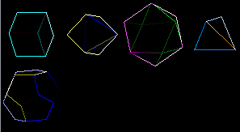

# module:extras/kernelmatrixshader

[Back to documentation index.](index.md)

### module:extras/kernelmatrixshader()

The <code>extras/kernelmatrixshader.js</code> module.
To import all symbols in this module, either of the following can be used:

    import * from "extras/kernelmatrixshader.js";
    // -- or --
    import * as CustomModuleName from "extras/kernelmatrixshader.js";

### Members

* [kernelMatrixShader](#extras_kernelmatrixshader.kernelMatrixShader) GLSL shader code for a family of image processing filters, such as blurring, sharpening,
edge detection, and embossing, that process each pixel and its neighbors.

### Methods

* [getKernelMatrix](#extras_kernelmatrixshader.getKernelMatrix) TODO: Not documented yet.
* [normalizeKernelInPlace](#extras_kernelmatrixshader.normalizeKernelInPlace) TODO: Not documented yet.

### module:extras/kernelmatrixshader.kernelMatrixShader (constant)

GLSL shader code for a family of image processing filters, such as blurring, sharpening,
edge detection, and embossing, that process each pixel and its neighbors. This filter takes
a 3x3 matrix called a _convolution kernel_, which gives the contribution of each pixel's color to the final color. All the numbers in the matrix usually add up to 1. An example of a convolution kernel:

    [ 0, 1/8, 0,
    1/8, 1/2, 1/8,
    0, 1/8, 0 ]

This matrix means that the destination pixel will have 1/2 of the original pixel's color, and 1/8 of the
colors of its 4 adjacent pixels. Note that this example adds up to 1.

This shader program takes three uniforms: "sample", the source texture;
"textureSize", the width and height of the texture in pixels;
"matrix", the 3x3 convolution kernel.

### (static) module:extras/kernelmatrixshader.getKernelMatrix(kind)

TODO: Not documented yet.

#### Parameters

* `kind` (Type: <a href="_.md">*</a>)

#### Return Value

Return value. (Type: <a href="_.md">*</a>)

### (static) module:extras/kernelmatrixshader.normalizeKernelInPlace(matrix)

TODO: Not documented yet.

#### Parameters

* `matrix` (Type: <a href="_.md">*</a>)

#### Return Value

Return value. (Type: <a href="_.md">*</a>)

[Back to documentation index.](index.md)
