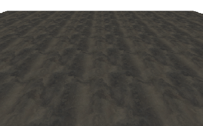
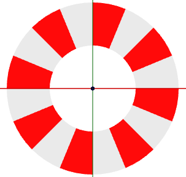

# Examples of Creating Meshes on the Fly

[Back to documentation index.](index.md)

This page contains source code for creating various kinds of 3D models on the fly.

## Contents

- [Contents](#Contents)
- [3D Line](#3D_Line)
- [Floor](#Floor)
- [Striped Disk](#Striped_Disk)
- [Washer](#Washer)
- [Miscellaneous](#Miscellaneous)

## 3D Line

This method creates a thin line-like 3D object.

    // point1, point2 - end points of the line
    // thickness - thickness of the line in units, default 1
    function create3DLine(point1,point2,thickness){
      if(thickness==null)thickness=1
      var vector=H3DU.Math.vec3sub(point1,point2);
      var dist=H3DU.Math.vec3length(vector);
      var normVector=H3DU.Math.vec3norm(vector);
      var midPoint=H3DU.Math.vec3lerp(point1,point2,0.5);
      var line=H3DU.Meshes.createCapsule(thickness/2,dist,6,4);
      var matrix=H3DU.Math.quatToMat4(H3DU.Math.quatFromVectors([0,0,1],normVector));
      matrix[12]=midPoint[0]
      matrix[13]=midPoint[1]
      matrix[14]=midPoint[2]
      return line.transform(matrix);
    }

## Floor

This method creates a flat tiled floor.

    // xStart, yStart - X and Y coordinates of the start of the floor
    // width, height - Width and height of the floor
    // tileSize - Size of each floor tile
    // z - Z coordinate where the floor will be placed (optional,
    // default 0)
    function makeFloor(xStart,yStart,width,height,tileSize,z){
     if(z==null)z=0.0
     var mesh=new H3DU.Mesh()
     var tilesX=Math.ceil(width/tileSize)
     var tilesY=Math.ceil(height/tileSize)
     var lastY=(height-(tilesY*tileSize))/tileSize
     var lastX=(width-(tilesX*tileSize))/tileSize
     if(lastY<=0)lastY=1.0
     if(lastX<=0)lastX=1.0
     mesh.normal3(0,0,1)
     for(var y=0;y<tilesY;y++){
      var endY=(y==tilesY-1) ? 1.0-lastY : 0.0
      var endPosY=(y==tilesY-1) ? yStart+height : yStart+(y+1)*tileSize
      for(var x=0;x<tilesX;x++){
       var endX=(x==tilesX-1) ? lastX : 1.0
       var endPosX=(x==tilesX-1) ? xStart+width : xStart+(x+1)*tileSize
       mesh.mode(H3DU.Mesh.TRIANGLE_STRIP)
         .texCoord2(0,1).vertex3(xStart+x*tileSize,yStart+y*tileSize,z)
         .texCoord2(0,endY).vertex3(xStart+x*tileSize,endPosY,z)
         .texCoord2(endX,1).vertex3(endPosX,yStart+y*tileSize,z)
         .texCoord2(endX,endY).vertex3(endPosX,endPosY,z)
      }
     }
     return new H3DU.MeshBuffer(mesh)
    }

## Striped Disk

This method creates a ring or disk striped in two colors.

    // inner, outer - inner and outer radius of the disk
    // color1, color2 - colors of each stripe; for example:
    //   "red", "#223344", "rgb(255,0,0)", [0,1,0]
    // sections - number of stripes
    // sectionCount - number of sections per stripe
    function stripedDisk(inner,outer,color1,color2,sections,sectionCount){
     if(sectionCount==null)sectionCount=4
     var firstColor=true
     var ret=new H3DU.MeshBuffer()
     var sweep=360.0/sections;
     for(var i=0;i<sections;i++){
      var angle=360.0*(i*1.0/sections);
      var mesh=H3DU.Meshes.createPartialDisk(inner,outer,sectionCount,1,angle,sweep)
         .setColor3(firstColor ? color1 : color2)
      firstColor=!firstColor
      ret.merge(mesh);
     }
     return ret;
    }

## Washer

This method creates a washer-shaped 3D model.

    function createWasher(inner,outer,height,slices){
      var innerCylinder=H3DU.Meshes.createCylinder(inner,inner,height,slices,1,false,true);
      var outerCylinder=H3DU.Meshes.createCylinder(outer,outer,height,slices,1,false,false);
      var base=H3DU.Meshes.createDisk(inner,outer,slices,2,true).reverseWinding();
      var top=H3DU.Meshes.createDisk(inner,outer,slices,2,false);
      // move the top disk to the top of the cylinder
      top.transform(H3DU.Math.mat4translated(0,0,height));
      // merge the base and the top
      return innerCylinder.merge(outerCylinder).merge(base).merge(top);
    }

## Miscellaneous
    // Demonstrates making a mesh plane from triangles
    function createPathDisk(path, z, flatness){
     if(z==null)z=0
     var tris=path.getTriangles(flatness);
     var mesh=new H3DU.Mesh().mode(H3DU.Mesh.TRIANGLES)
       .normal3(0,0,1);
     for(var i=0;i<tris.length;i++){
      var tri=tris[i]
      mesh.vertex3(tri[0],tri[1],z)
       .vertex3(tri[2],tri[3],z)
       .vertex3(tri[4],tri[5],z)
     }
     return new H3DU.MeshBuffer(mesh)
    }

    function setBoxSizeAndBounds(shape,box){
     shape.setPosition(H3DU.Math.boxCenter(box))
     shape.setScale(H3DU.Math.boxDimensions(box))
     return shape
    }

    function wireBox(box, color){
      if(!color)color="gray";
     var boxMesh=H3DU.Meshes.createBox(1,1,1).toWireFrame()
     var shape=new H3DU.Shape(boxMesh).setMaterial(
        H3DU.Material.fromBasic(color))
     return setBoxSizeAndBounds(shape,box)
    }

[Back to documentation index.](index.md)
