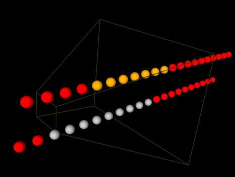
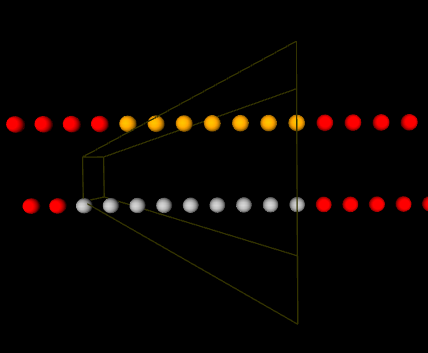

## Introduction

This article describes projection and view transforms commonly used in 3D graphics,
especially when using my [HTML 3D Library](http://peteroupc.github.io/html3dutil).

**Download the latest version of the library at the [HTML 3D Library's Releases page](https://github.com/peteroupc/html3dutil/releases).**

## The "Camera" and the Projection and View Transforms

The [`Scene3D`](http://peteroupc.github.io/html3dutil/glutil.Scene3D.html) class of the HTML 3D Library has a concept of a "projection transform" and a "view transform". If we use the concept of a "camera", the projection is like setting the camera's focus and lens, and the view transform is like setting its position and orientation. `Scene3D` has methods for setting all these attributes of this abstract "camera". Two of them are [`setPerspective()`](http://peteroupc.github.io/html3dutil/glutil.Scene3D.html#.setPerspective) and [`setLookAt()`](http://peteroupc.github.io/html3dutil/glutil.Scene3D.html#.setLookAt), which are shown in the example below.

    // Set the perspective view.  Camera has a 45-degree field of view
    // and will see objects from 0.1 to 100 units away.
    scene.setPerspective(45,scene.getClientAspect(),0.1,100);
    // Move the camera back 40 units.
    scene.setLookAt([0,0,40]);
    // Move the camera back 30 units instead, and turn it so it
    // points at (0, 2, 0), that is, up 2 units.
    scene.setLookAt([0,0,30], [0,2,0]);

### Overview of Transformations

Here is an overview of transformations used in the graphics system and
the HTML 3D library.

* A _world matrix_ transforms an object's own coordinates to _world space_,
the coordinate system shared by every object in the scene.  The world matrix
is not discussed in this article.
* A _view matrix_ transforms coordinates in world space to _camera space_ or _eye space_.
* A _projection matrix_ transforms coordinates in camera space to _clip space_.
* Additionally, the graphics pipeline (outside the HTML 3D library) converts the
clip space coordinates to _normalized device coordinates_, then _screen space_
coordinates when drawing objects on the screen.

## Projection Transform

A _projection matrix_ transforms coordinates in camera space to _clip space_.

Two commonly used projections in 3D graphics are the perspective projection and
orthographic projection, described below.

### Perspective Projection

A perspective projection gives the 3D scene a sense of depth.  In this projection, closer objects
look bigger than more distant objects with the same size.

The perspective projection is similar to how our eyes see the world.

The 3D scene is contained in a so-called _view volume_, and only objects contained in the view volume
will be visible.  The dark yellow lines above show what a perspective view volume looks like.  The red spheres
would not be visible under this view volume.

The view volume is bounded on all six sides by six _clipping planes_:

* The near and far clipping planes are placed a certain distance from the camera.  For example, if
the near clipping plane is 3 units away and the far clipping plane is 5 units away, the view volume
will hold only objects between 3 and 5 units from the camera.  (Strictly speaking, a near clipping
plane is not necessary, but practically speaking it is, in order to make the math work out correctly.)
* The left, right, top, and bottom clipping planes form the other four sides of the volume.

Note further that:

* The angle separating the top and bottom clipping planes is the projection's _field of view_.  This is an angle
similar to the aperture of a camera.  The greater the vertical field of view, the greater
the vertical visibility range.
* In a perspective projection, the near clipping plane segment bounding the view volume is smaller than
the far clipping plane segment.  This is because the four other clipping planes are not parallel and extend
from the eye position.

The perspective projection converts 3D coordinates to 4-element vectors in the form (X, Y, Z, W), also
known as _clip coordinates_.  Since the graphics system (outside the HTML 3D library) only deals with
3D points, it divides the X, Y, and Z components by the W component to get the 3D point's _normalized
device coordinates_ and achieve the perspective effect.

The `Scene3D` class's [`setPerspective()`](http://peteroupc.github.io/html3dutil/glutil.Scene3D.html#.setPerspective)
and [`setFrustum()`](http://peteroupc.github.io/html3dutil/glutil.Scene3D.html#.setFrustum)
methods define a perspective projection.

**`scene3d.setPerspective(fov, aspect, near, far)`**

This method calculates the appropriate clipping planes given a field of view and an aspect ratio,
and sets the scene's projection matrix accordingly.

* `fov` - Vertical field of view, in degrees.
* `aspect` - Aspect ratio of the scene.  You should usually use `scene3d.getClientAspect()`.
* `near`, `far` - Distance from the camera to the near and far clipping planes.

**`scene3d.setFrustum(left, right, bottom, top, near, far)`**

This method sets the scene's projection matrix based on the location of the six clipping planes that
bound the view volume.  Their positions are chosen so that the result is a perspective projection.

* `left`, `right`, `bottom`, `top` - Location of the left, right, bottom, and top clipping planes in terms
of where they meet the near clipping plane.
* `near`, `far` - Distance from the camera to the near and far clipping planes.

#### Demo

* [perspective.html](https://peteroupc.github.io/html3dutil/demos/perspective.html) - Demonstrates a perspective projection.

### Orthographic Projection

An orthographic projection is one in which the left and right clipping planes are parallel to each other,
and the top and bottom clipping planes are parallel to each other.  This results in the near and far clipping
planes having the same size, unlike in a perspective projection, and
objects with the same size not varying in size with their depth.

The [`Scene3D`](http://peteroupc.github.io/html3dutil/glutil.Scene3D.html) class's [`setOrtho()`](http://peteroupc.github.io/html3dutil/glutil.Scene3D.html#.setOrtho)
and [`setOrthoAspect()`](http://peteroupc.github.io/html3dutil/glutil.Scene3D.html#.setOrthoAspect) methods
define an orthographic projection.

**`scene3d.setOrtho(left, right, bottom, top, near, far)`**

This method calculates an orthographic projection.

* `left` - Leftmost coordinate of the 3D view.
* `right` - Rightmost coordinate of the 3D view.
* `bottom` - Topmost coordinate of the 3D view.
* `top` - Bottommost coordinate of the 3D view.
* `near`, `far` - Distance from the camera to the near and far clipping planes.  Either value
can be negative.

**`scene3d.setOrthoAspect(left, right, bottom, top, near, far, aspect)`**

This method calculates an orthographic projection such that the resulting view isn't stretched
or squished in case the view volume's aspect ratio and the scene's aspect ratio are different.

* `left`, `right`, `bottom`, `top`, `near`, `far` - Same as in `setOrtho`.
* `aspect` - Aspect ratio of the viewport.  May be omitted, in which case the scene's
aspect ratio (`scene.getClientAspect()`) is used.

### Other Projections

There are other kinds of possible projections, such as oblique projections
or isometric projections.  For these
and other projections, you can specify a custom projection matrix to the 3D scene using the
[`setProjectionMatrix()`](http://peteroupc.github.io/html3dutil/glutil.Scene3D.html#.setProjectionMatrix)
method.

**`scene3d.setProjectionMatrix(matrix)`**

This method allows you to set the projection matrix to an arbitrary [4x4 matrix]{@tutorial glmath}.

* `matrix` - The 4x4 matrix to use.

## View Transform

The view matrix transforms _world space_ coordinates, shared by every object in a scene, to _camera space_
coordinates, in which the camera is located at the center of the coordinate system: (0, 0, 0).  A view matrix essentially rotates the camera and moves it to a given position in world space.  Specifically:

* The camera is rotated to point at a certain object or location on the scene.  This is represented by
the `lookingAt` parameter in the `setLookAt()` method, below.
* The camera is placed somewhere on the scene.  This is represented by
the `eye` parameter in the `setLookAt()` method.  It also represents the "eye position" in the perspective
projection, above.
* The camera rolls itself, possibly turning it sideways or upside down.  This is represented by
the `up` parameter in the `setLookAt()` method.  Turning the camera upside down, for example, will swap
the placement of the top and bottom clipping planes, thus inverting the view of the scene.

The `setLookAt()` and `setViewMatrix()` methods are described below.

**`scene3d.setLookAt(eye, lookingAt, up)`**

This method allows you to set a view matrix based on the camera's position and view.

* `eye` - Array of three elements (X, Y, Z) giving the position of the camera in world space.
* `lookingAt` - Array of three elements (X, Y, Z) giving the position the camera is looking at in world space.
This is optional.  The default is [0, 0, 0].
* `up` - Array of three elements (X, Y, Z) giving the vector from the center of the camera to the top.
This is optional.  The default is [0, 1, 0].

**`scene3d.setViewMatrix(matrix)`**

This method allows you to set the view matrix to an arbitrary [4x4 matrix]{@tutorial glmath}.

* `matrix` - The 4x4 matrix to use.
