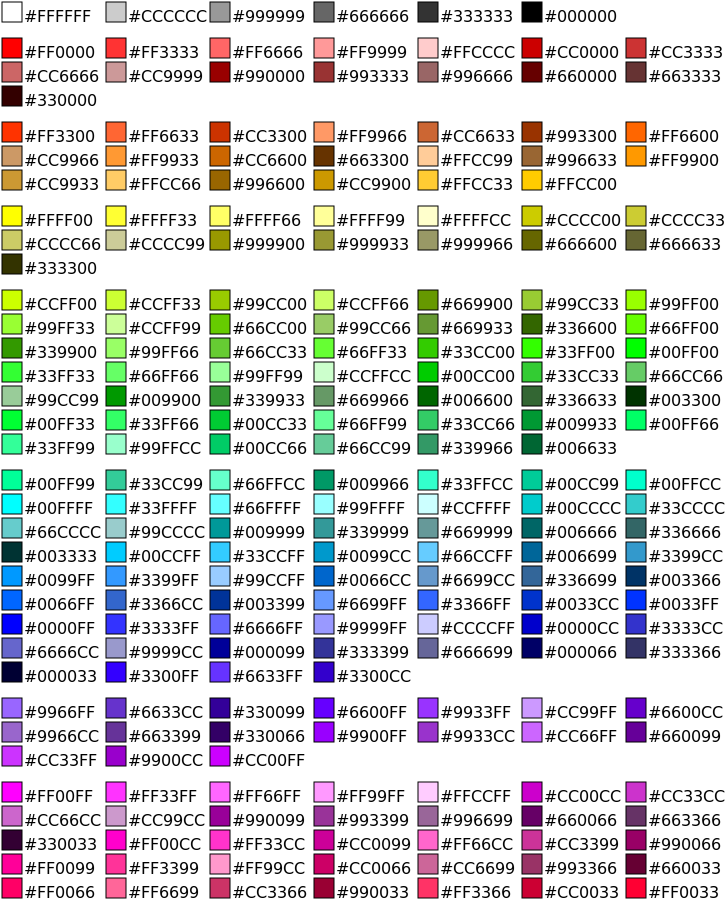
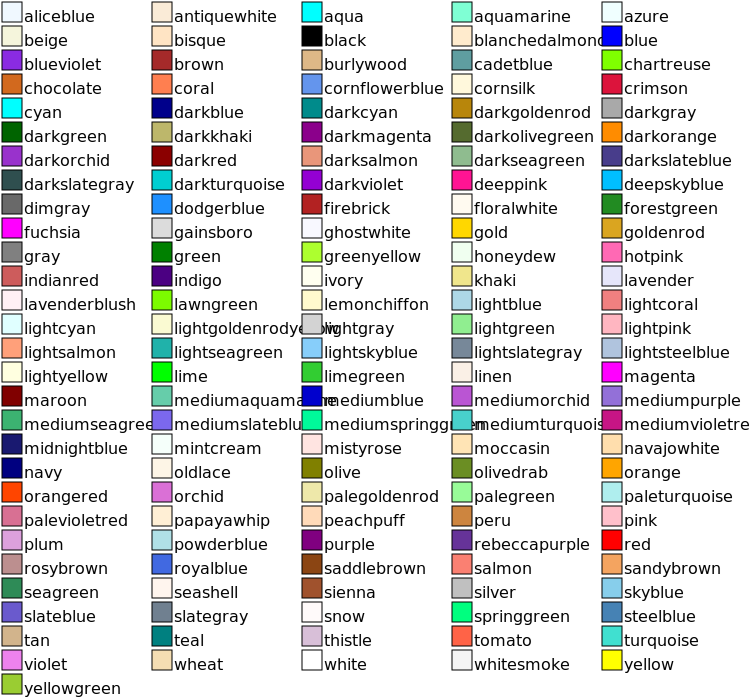

This page describes common identifiers and names for colors, as used in the HTML 3D Library's `toGLColor` method.

## Contents

[Contents](#Contents) [What Colors Can I Use?](#What_Colors_Can_I_Use) [What Do Some Colors Look Like?](#What_Do_Some_Colors_Look_Like) [What Is the Syntax for HTML Colors?](#What_Is_the_Syntax_for_HTML_Colors) &nbsp;&nbsp;[Shortened Notation](#Shortened_Notation) [How Do I Make HTML Colors?](#How_Do_I_Make_HTML_Colors) [What Are Some Common HTML Colors?](#What_Are_Some_Common_HTML_Colors) [How Do I Darken an HTML Color?](#How_Do_I_Darken_an_HTML_Color) [How Do I Lighten a HTML Color?](#How_Do_I_Lighten_a_HTML_Color) [How Do I Desaturate an HTML Color?](#How_Do_I_Desaturate_an_HTML_Color) [What Is an RGB Color?](#What_Is_an_RGB_Color) [What Is an HSL Color?](#What_Is_an_HSL_Color) &nbsp;&nbsp;[HSL Example](#HSL_Example) [What Is an Alpha Component?](#What_Is_an_Alpha_Component) 

## What Colors Can I Use?

You can use values like the following.

* CSS color names: `red`, `blue`, `silver`, `fuchsia`, `darkslateblue`.
* HTML &#8220;hex colors&#8221;: `#223344`, `#234`, `#234F`, or `#223344FF`. (See &#8220;What Is the Syntax for HTML Colors?&#8221;)
* RGB colors: `rgb(20,30,40)` or `rgba(20,30,40,50%)`. (See &#8220;What Is an RGB Color?&#8221;, below.)
* HSL colors: `hsl(200,100%,50%)` or `hsla(200,100%,50%,80%`. (See &#8220;What Is an HSL Color?&#8221;, below.)
* The newly-added color name `rebeccapurple`.
* The word `transparent`, meaning a fully-transparent color.

## What Do Some Colors Look Like?

Here is a list of useful colors sorted by hue or color tone.  This particular list was historically called the "Web safe" colors, which were chosen "specifically because they matched the palettes selected by the then leading browser applications" for 256-color displays (according to [Wikipedia](http://en.wikipedia.org/wiki/Web_colors)), but this list is still useful because it's short yet gives you a variety of appropriate colors for most purposes.

The following list shows the colors defined in the [CSS3 Color Module section 4](http://www.w3.org/TR/css3-color/#colorunits), as well as the newly-added name `rebeccapurple`. In addition, the names `darkgrey`,
`darkslategrey`,
`dimgrey`,
`grey`,
`lightgrey`,
`lightslategrey`, and
`slategrey` can be used instead of `darkgray`,
`darkslategray`,
`dimgray`,
`gray`,
`lightgray`,
`lightslategray`, and
`slategray`.

## What Is the Syntax for HTML Colors?

The notation used to name the colors in the preceding section is used in HTML to define colors. It&#8217;s also known as &#8220;hex colors&#8221;.

Take `#ff80cc` as an example. The color defined is a carnation pink. There are four parts to this example:

* The `#` identifies this word as a color.
* The `ff` is two letters and/or digits that show the red component of the color. This is a so-called hexadecimal number, or base-16 number. Each digit of this number can range from 0-9 and from A-F, with 0 being the lowest digit, and F being the highest digit. The highest two-digit value is 00, and the lowest two-digit value is FF (256). (The digits A-F may appear in upper or lower case.)
* The `80` is a base-16 number showing the color&#8217;s green component.
* The `cc` is a base-16 number showing the color&#8217;s blue component.

The notation may also include an additional base-16 number, as in this example: `#ac80ccff`.  Here, the last `ff` shows the color's alpha component (see "What Is an Alpha Component?", below).

It looks complicated at first, but the section "How Do I Make HTML Colors?" will show a way to easily make your own colors in this notation.

### Shortened Notation

* Colors with only three base-16 digits are the same as their expanded six-digit form. For example, `#f8c` is the same as `#ff88cc`.
* Colors with only four base-16 digits are the same as their expanded eight-digit form. For example, `#f8ce` is the same as `#ff88ccee`.

## How Do I Make HTML Colors?

Look at the table below that shows some of the values possible for the red, green, and blue components of some colors.

    Red 00 10 20 30 40 50 60 70 80 90 A0 B0 C0 D0 E0 F0 FF
    Green 00 10 20 30 40 50 60 70 80 90 A0 B0 C0 D0 E0 F0 FF
    Blue 00 10 20 30 40 50 60 70 80 90 A0 B0 C0 D0 E0 F0 FF

Now, to make a custom color, you choose one value from the red row, one value from the green row, and one value from the blue row. Each value shows the intensity of the light that the color reflects. For example, a red value of 00 means that no red light is reflected, and a red value of FF means that red light is fully reflected.

If you choose the same value in all three rows, the result is black (if you choose 00), white (if you choose FF) or a shade of gray. This shows that red, green, and blue light are equally reflected.

After you choose the three values, combine them by writing the `#`, then the red value, then the green value, then the blue value. For example, if you choose `FF` for red, `A0` for green, and `00` for blue, write the resulting color (orange) like this: `#FFA000`.

## What Are Some Common HTML Colors?

Now, what follows is a list of common colors that are possible by choosing a value in each row. See also the list of colors sorted by hue.

| Name | Red | Green | Blue | Color |
 ------|-----|-------|------|-------|
| Red | FF | 00 | 00 | #FF0000 |
| Orange | FF | A0 | 00 | #FFA000 |
| Yellow | FF | 80 | 00 | #FF8000 |
| Bright Green | 00 | FF | 00 | #00FF00 |
| Dark Green | 00 | 80 | 00 | #008000 |
| Sky Blue|00 | FF | FF | #00FFFF |
| Blue  | 00 | 00 | FF | #0000FF |
| Purple | C0 | 00 | FF | #CC00FF |
| Hot Pink | FF | 00 | FF | #FF00FF |
| Black | 00 | 00 | 00 | #000000 |
| White |  FF | FF | FF | #FFFFFF |
| Gray  | 80 | 80 | 80 | #808080 |

## How Do I Darken an HTML Color?

To darken a color (make a *shade* of it), use the table shown in &#8220;How Do I Make HTML Colors?&#8221;, above, and move each component (red, green, and blue) the same number of steps to the left. If you can&#8217;t move a component that far to the left, that component becomes 00.

For example, to make a darker sky blue, start with 00, FF, and FF for red, green, and blue. When we move these components ten steps to the left, we get 00, 60, and 60. The final color becomes #006060.

## How Do I Lighten a HTML Color?

Lightening a color (making a *tint* of it) is almost the same as darkening a color, except we move the same number of steps to the right rather than the left. If you can&#8217;t move a component that far to the right, that component becomes FF.

For example, to make a lighter red, start with FF, 00, and 00 for red, green, and blue. When we move these components ten steps to the right, we get FF, A0, and A0. The final color becomes #FFA0A0.

## How Do I Desaturate an HTML Color?

To make a desaturated (washed-out) version (or *tone*) of a color, move the color components closer to each other, in about the same proportion. (If they&#8217;re exactly the same, the result is a shade of gray.)

For example, to make a washed-out red, start with FF, 00, and 00 for red, green, and blue. When we move these components closer to each other, we get C0, 40, and 40. The final color becomes #C04040.

## What Is an RGB Color?

An RGB color contains the same information as an HTML color, except that each value is shown in the familiar base-10 format. For example, the value `rgb(192,64,0)` is the same as the HTML color value `#C04000`.

The components of the RGB color (red, green, and blue, in that order) can range from `0` to `255`, or from `0%` to `100%`, but mixing ranges is not allowed. For example, `rgb(192,64,0)` and `rgb(80%,50%,0%)` are allowed, but not `rgb(192,50%,0%)`.

The steps for darkening, lightening, and desaturating RGB colors are pretty much the same as with HTML colors.

An alternate syntax for RGB colors supports the alpha component (see "What Is an Alpha Component?", below): in the example `rgba(192,64,0,0.5)`, the `0.5` is the alpha component. This component can be used with either range for RGB colors, either 0-255 or percentages. (Note that the example starts with `rgba`, not just `rgb`.)

## What Is an HSL Color?

An HSL color is a color represented in the Hue-Saturation-Lightness color space. Here&#8217;s what each component means in detail.

* **Hue** ranges from 0 to 360 degrees. Each angle on the color wheel stands for a different hue:

    * Reds have hue 0 (say, 12 o&#8217;clock);
    * Yellows have hue 60 (2 o&#8217;clock);
    * Greens have hue 120 (4 o&#8217;clock);
    * Cyans (Sky-blues) have hue 180 (6 o&#8217;clock);
    * Blues have hue 240 (8 o&#8217;clock); and
    * Magentas have hue 300 (10 o&#8217;clock).

* **Saturation**, or vividness, ranges from 0% to 100%. 100% stands for the purest, most vivid color. The lower the number, the greater the amount of gray in the color. 0% means the color is totally gray. Therefore, ***to desaturate a color***, simply lower the amount of saturation.

* **Lightness** is also a value ranging from 0% to 100%. It expresses the amount of black or white in the color. 0% means fully black, 100% means fully white, and 50% means the color contains neither black nor white. ***To darken a color***, lower the lightness, and ***to lighten a color***, raise the lightness.

### HSL Example

The value `hsl(240,100%,50%)` has a hue of 240 (blue), a saturation of 100% (fully saturated), and a lightness of 50% (neither black or white). It represents a vivid blue. If we lower lightness to 20%, we get a dark blue. If we also change the hue to 0, we get a dark red.

An alternate syntax for HSL colors supports the alpha component (see "What Is an Alpha Component?", below): in the example `hsla(240,100%,50%,80%)`, the `80%` is the alpha component.

## What Is an Alpha Component?

An alpha component shows how much the color is transparent (see-through) or opaque.  The alpha component can range from `00`/`0.0`, or "fully transparent" (completely invisible), to `FF`/`1.0`, or "fully opaque" (letting nothing through it). If a color notation doesn't use an alpha component, the color is fully opaque.
