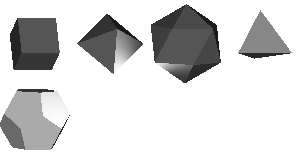
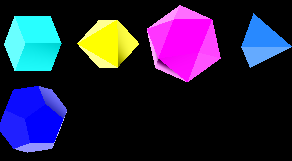
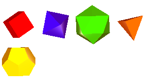
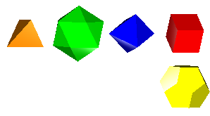
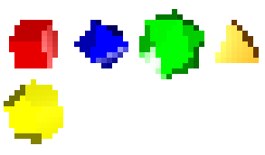
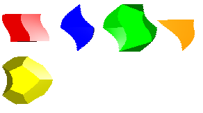
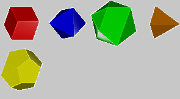

## Introduction

This page describes what graphics filters are and how they work in my
public domain [HTML 3D Library](http://peteroupc.github.io/html3dutil).
It also describes several examples of graphics filters.

**Download the latest version of the library at the [HTML 3D Library's Releases page](https://github.com/peteroupc/html3dutil/releases).**

## Graphics Filters

In the HTML 3D Library, graphics filters are functions used to modify the appearance
of the screen after each frame.  They are implemented in a language called GLSL, or GL
Shading Language.  GLSL programs are called "shaders", and they are compiled into code that runs on a GPU,
or graphics processing unit.

Graphics filters are considered "fragment shaders", or shaders that process one pixel at a time.  GPUs can run
shaders very fast because fragment shaders can process each pixel in parallel, without affecting the other
pixels, and GPUs are often much better designed for parallel processing than CPUs.

For graphics filters to work, the 3D scene must be rendered to an off-screen buffer called
a _frame buffer_.  The frame buffer acts like a 3D texture which will be rendered back to
the screen with the help of the graphics filter's shader program.

## Writing Graphics Filters

In the HTML 3D Library, use the `makeEffect` method of the ShaderProgram class to create
graphics filters:

* The `ShaderProgram` class holds data on shader programs.  Each shader program consists
of a _vertex shader_ and a _fragment shader_.  Graphics filters are essentially part of a fragment shader
and thus processes pixels.  (Vertex shaders, which process vertices of triangles, lines, and points,
are not discussed on this page.)
* The `makeEffect` method creates a shader program and compiles it, using the graphics
filter as part of the program's fragment shader.  Since shader programs must also have a vertex
shader, the method also adds a very basic vertex shader for the graphics filter.

The following is an example of a graphics filter.

    return ShaderProgram.makeEffect(context,[
    "vec4 textureEffect(sampler2D sampler, vec2 uvCoord, vec2 textureSize){",
    // Read the current color from the sampler texture
    " vec4 color=texture2D(sampler,uvCoord);",
    // Convert the color to a shade of gray.  It gets
    // the current color's red, green, and blue components,
    // adds them, and divides by 3.  Thus, the gray color
    // will be an average of the red/green/blue components.
    " float gray=(color.r+color.g+color.b)/3.0;",
    // Return the gray color (using the color's original alpha)
    " return vec4(gray,gray,gray,color.a);",
    "}"].join("\n"));

Each graphics filter must have a GLSL function called `textureEffect()`, like in the example above.
The `textureEffect` function takes these parameters:

* `sampler2D sampler`: Points to a texture representing a screenshot of the current frame.  To read from
  the texture, use the `texture2D` function, as shown in the example above.
* `vec2 uvCoord`: Texture coordinates of the current pixel.  `uvCoord.x` ranges from 0 on the left side
  to 1 on the right side.  `uvCoord.y` ranges from 0 on the bottom side to 1 on the top side.  (Note that
  texture coordinates start from the bottom-left corner, not the top left, that is, textures are "bottom up",
  not "top down").
* `vec2 textureSize`: Size of the screenshot, pointed to by `sampler`, in pixels.  `textureSize.x` is the
  width, and `textureSize.y` is the height.

The `textureEffect` function returns a `vec4` (4-element vector) giving the color that the current pixel should
be.  The example above reads the current pixel's color, turns it to a shade of gray, and returns a new color
with that shade of gray.  Thus, the filter will convert the screen to grayscale tones.

The shader can also define custom parameters called "uniforms".  They are declared by using a line like
`uniform [type] [name];` at the top of the shader.  Example: `uniform float time;`  Uniforms, once declared,
can be used in the `textureEffect` function.

A detailed treatment of GLSL is outside the scope of this page.  More information about GLSL can
be found by searching the Web; note that there are many versions of GLSL and the one used
in HTML applications is relatively basic nowadays.  Also see below for more examples of graphics filters.

## Using Graphics Filters

After a filter is created, it's very easy to use; it's simply set with the `useFilter` method of Scene3D.  After
a filter is set, here's how it works:

* When the `useFilter` method is called to set a new graphics filter, the HTML 3D Library creates a
  _frame buffer_.  A frame buffer consists of a texture with the same size as the 3D canvas and a _renderbuffer_
  to use as the depth buffer.
* When the `render()` method is called each frame:
    * The library ensures that the frame buffer is the same size as the 3D canvas.
    * The 3D library switches drawing to use the frame buffer rather than the 3D canvas, then
      switches the shader to the usual shaders for drawing the 3D scene.
    * The current frame is rendered onto the frame buffer.  The frame buffer's texture will now contain a
      "snapshot" of the frame that can now be modified by graphics filters.
    * The 3D library switches drawing back to the 3D canvas, then switches the shader
      to the graphics filter's shaders.
    * A rectangle taking up the entire 3D canvas is drawn.  This is to allow each pixel of the texture to
      be passed to the graphics filter, and the filter's `textureEffect` method to be called for each pixel.
      Any custom parameters, or "uniforms", given to the graphics filter will be set before drawing.
      The graphics filter can either use the current pixel's color or change it for each pixel.
      As a result, a "filtered" version of the current frame will be drawn.

Currently, the HTML 3D Library only supports one filter at a time, so if the HTML app needs to use more
than one effect, say, a grayscale and blur, both effects need to be combined in the same graphics filter
shader.

## Examples

* [squares.html](https://peteroupc.github.io/html3dutil/demos/squares.html) - Demonstrates graphics filters.

The demo [squares.html](https://peteroupc.github.io/html3dutil/demos/squares.html) includes a number
of graphics filters implemented as shaders.

Here are more details on the filters it includes.

### Grayscale

The grayscale filter, which converts the screen to black and white, was already given above.

### Invert

The invert filter is built-in to the HTML 3D Library.  It inverts the colors of the screen so the effect looks
like a film negative.

This filter is implemented in the method `ShaderProgram.getInvertEffect()`:

    ShaderProgram.getInvertEffect=function(context){
    return ShaderProgram.makeEffect(context,
    [
    "vec4 textureEffect(sampler2D sampler, vec2 uvCoord, vec2 textureSize){",
    " vec4 color=texture2D(sampler,uvCoord);",
    " vec4 ret; ret.xyz=vec3(1.0,1.0,1.0)-color.xyz; ret.w=color.w; return ret;",
    "}"].join("\n"));
    }

### Red Tint

The grayscale filter adds a hint of red to the image.

    function makeRedTint(context){
    return ShaderProgram.makeEffect(context,[
    "vec4 textureEffect(sampler2D sampler, vec2 uvCoord, vec2 textureSize){",
    " vec4 color=texture2D(sampler,uvCoord);",
    " return vec4(color.r+0.3,color.g,color.b,color.a);",
    "}"].join("\n"));
    }

### Mirror Filter

This filter does a horizontal flip of its pixels.  Note that the filter, given below, reads not from
the current pixel, but rather the pixel from the opposite side to the current pixel (it takes 1 minus
the current X coordinate).

    function makeMirror(context){
    return ShaderProgram.makeEffect(context,[
    "vec4 textureEffect(sampler2D sampler, vec2 uvCoord, vec2 textureSize){",
    " vec4 color=texture2D(sampler,vec2(1.0-uvCoord.x,uvCoord.y));",
    " return color;",
    "}"].join("\n"));
    }

With a simple change, this filter can be modified to do a vertical flip (`1.0-uvCoord.y`) or even both flips.

### Matrix Filter

This filter enables a family of image processing filters, such as blurring, sharpening,
edge detection, and embossing, that process each pixel and its neighbors.  This filter takes
a 3x3 matrix called a _convolution kernel_, which gives the contribution of each pixel's color
to the final color.  All the numbers in the matrix must add up to 1.

Note that the `uniform` given below is a `mat3`, meaning a 3x3 matrix.

An example of a convolution kernel:

    [  0,  1/8, 0,
      1/8, 1/2, 1/8,
      0,   1/8, 0  ]

This filter means that the destination pixel will have 1/2 of the original pixel's color, and 1/8 of the
colors of its 4 adjacent pixels.  Note that this example adds up to 1.

This filter is implemented in the function `makeKernelMatrix` in the demo.  It is used for
the "blur" and "edge detect" effects.  The filter shows how it's possible for filters to read neighboring
pixels, not just the current pixel, when implementing their effect.

### Pixelate Filter

This filter pixelates the screen, in effect, by scaling it down and then scaling it up.
This filter takes a `uniform` named `coarseness`, which indicates how many normal pixels
each "pixelated" pixel takes up.

    function makePixelate(context){
    return ShaderProgram.makeEffect(context,[
    "uniform float coarseness;", // coarseness in pixels; 1 means normal
    "vec4 textureEffect(sampler2D sampler, vec2 uvCoord, vec2 textureSize){",
    " float g=max(coarseness,1.0);",
    " float gridSizeX=textureSize.x/g;",
    " float gridSizeY=textureSize.y/g;",
    " float uv0=floor(uvCoord.x*gridSizeX)/gridSizeX;",
    " float uv1=floor(uvCoord.y*gridSizeY)/gridSizeY;",
    " vec4 c=texture2D(sampler,vec2(uv0,uv1));",
    " return c;",
    "}"].join("\n"));
}

The demo changes the "coarseness" parameter with time to animate the pixelation effect.

### Wave Filter

This filter shifts the pixels in each row horizontally to cause the screen to undulate
vertically.  This filter takes a `uniform` named `time`, which indicates the animation
frame for the undulation effect.

This filter is implemented in the function `makeWave` in the demo.

### Waterpaint Filter

This is a watercoloring effect based on a public domain shader by someone
named "Themaister".

This filter is implemented in the function `makeWaterpaint` in the demo.

## Other Pages

The following pages of mine on CodeProject also discuss this library:

* [_Public-Domain HTML 3D Library_](http://www.codeproject.com/Tips/896839/Public-Domain-HTML-ThreeD-Library)
* [_Creating shapes using the Public Domain HTML 3D Library_](http://www.codeproject.com/Tips/987914/Creating-shapes-using-the-Public-Domain-HTML-D-Lib)
* [_Drawing parametric surfaces using the Public Domain HTML 3D Library_](http://www.codeproject.com/Tips/990798/Drawing-Parametric-Surfaces-Using-the-Public-Domai)
* [_The "Camera" and the Projection and View Transforms_](http://www.codeproject.com/Tips/989978/The-Camera-and-the-Projection-and-View-Transforms)
