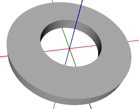

This page contains source code for creating various kinds of 3D models on the fly.

## Contents 

[Contents](#Contents) [3D Line](#3D_Line) [Cone](#Cone) [Striped Disk](#Striped_Disk) [Washer](#Washer) 

## 3D Line 

This method creates a thin line-like 3D object.

    // point1, point2 - end points of the line
    // thickness - thickness of the line in units, default 1
    function create3DLine(point1,point2,thickness){
      if(thickness==null)thickness=1
      var vector=GLMath.vec3sub(point1,point2);
      var dist=GLMath.vec3length(vector);
      var normVector=GLMath.vec3norm(vector);
      var midPoint=GLMath.vec3lerp(point1,point2,0.5);
      var line=Meshes.createCapsule(thickness/2,dist,6,4);
      var matrix=GLMath.quatToMat4(GLMath.quatFromVectors([0,0,1],normVector));
      matrix[12]=midPoint[0]
      matrix[13]=midPoint[1]
      matrix[14]=midPoint[2]
      return line.transform(matrix);
    }

## Cone 

This method creates a cone that's closed at its base.

    function createClosedCone(radius,height,slices){
      return Meshes.createClosedCylinder(radius,0,height,slices,1);
    }

## Striped Disk 

This method creates a ring or disk striped in two colors.

    // inner, outer - inner and outer radius of the disk
    // color1, color2 - colors of each stripe; for example:
    //   "red", "#223344", "rgb(255,0,0)", [0,1,0]
    // sections - number of stripes
    // sectionCount - number of sections per stripe
    function stripedDisk(inner,outer,color1,color2,sections,sectionCount){
     if(sectionCount==null)sectionCount=4
     var firstColor=true
     var ret=new Mesh()
     var sweep=360.0/sections;
     for(var i=0;i<sections;i++){
      var angle=360.0*(i*1.0/sections);
      var mesh=Meshes.createPartialDisk(inner,outer,sectionCount,1,angle,sweep)
         .setColor3(firstColor ? color1 : color2)
      firstColor=!firstColor
      ret.merge(mesh);
     }
     return ret;
    }

## Washer 

This method creates a washer-shaped 3D model.

    function createWasher(inner,outer,height,slices){
      var innerCylinder=Meshes.createCylinder(inner,inner,height,slices,1,false,true);
      var outerCylinder=Meshes.createCylinder(outer,outer,height,slices,1,false,false);
      var base=Meshes.createDisk(inner,outer,slices,2,true).reverseWinding();
      var top=Meshes.createDisk(inner,outer,slices,2,false);
      // move the top disk to the top of the cylinder
      top.transform(GLMath.mat4translated(0,0,height));
      // merge the base and the top
      return innerCylinder.merge(outerCylinder).merge(base).merge(top);
    }
