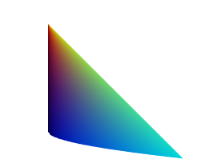
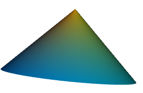

## Introduction

This tip describes parametric surfaces and how to generate them using my
public-domain [HTML 3D Library](http://peteroupc.github.io/html3dutil).

**Download the latest version of the library at the [HTML 3D Library's Releases page](https://github.com/peteroupc/html3dutil/releases).**

## What Is a Parametric Surface?

A _parametric surface_ is a surface generated by evaluating the results of a _vector function_.  This vector function
takes two numbers, U and V, and returns a 3D point, X, Y, and Z.  Each (U, V) point corresponds to an (X, Y, Z)
point that lies on the surface.

A _vector function_ in 3D is a combination of three functions, one for each axis:

* **F**(u, v) = [ _x_(u, v), _y_(u, v), _z_(u, v) ];

The _x_ function returns an X coordinate given u and v, and likewise for _y_ and _z_.
Since the _z_ function returns a Z coordinate, the surface will be in 2D if _z_ always returns
the same value.

For example, if we have a parametric surface defined by the following functions:

* _x_(u, v) = u * v
* _y_(u, v) = -u
* _z_(u, v) = u * sqrt(v)

and we evaluate the UV point (2, 4), then we have:

* **F**(2, 3) = [ 2 * 4, -2, 2 * sqrt(4) ];
* **F**(2, 3) = [ 8, -2, 4 ];

So (8, -2, 4) is one point that lies on this parametric surface, and any other point on the
surface can be found by evaluating different UV points.  By the way, the surface looks like this:

## Parametric Surfaces in the HTML 3D Library

The HTML 3D Library supports parametric surfaces using a class named `SurfaceEval`.  It helps
generate vertex coordinates, texture coordinates, normals, and colors using a parametric surface
function.  The following helper function, `makeMesh`, generates a parametric surface mesh
that was used to produce the pictures on this page.

The comments explain how `makeMesh` works in detail.

    function makeMesh(func){
      // create a new mesh
     var mesh=new Mesh();
     // define a color gradient evaluator for
     // demonstration purposes.  Instead of X, Y, and Z,
     // generate a Red/Green/Blue color based on
     // the same parameters U and V as the surface
     // function for 3D points.
     var colorGradient={
      evaluate:function(u,v){ return [1-u,v,u]; }
     }
     // generate the parametric surface.
     // First, create a SurfaceEval object
     var ev=new SurfaceEval()
    // Specify the vertex evaluator passed as _func_
      .vertex(func)
    // Specify the color gradient evaluator defined above
      .color(colorGradient)
    // Generate normals for the parametric surface,
    // which is required for lighting to work correctly
      .setAutoNormal(true)
    // Evaluate the surface and generate a triangle
    // mesh, using 51 different U-coordinates ranging
    // from 0 to 1 (50 subdivisions plus 1), and 51
    // different V-coordinates ranging from 0 to 1
    // Instead of Mesh.TRIANGLES, we could use
    // Mesh.LINES to create a wireframe mesh,
    // or Mesh.POINTS to create a point mesh.
      .evalSurface(mesh,Mesh.TRIANGLES,50,50);
     // Surface generated, return the mesh
     return mesh;
   }

In the HTML 3D Library, parametric surface objects define one method, "evaluate",
which returns a 3D point given a U parameter and a V parameter.  (By default, U and
V each range from 0 through 1.)

The following code is a very simple surface evaluator.

    var evaluator = {
      "evaluate":function(u, v){
        // Take the U parameter as the X coordinate,
        // the V parameter as the X coordinate, and 0 as
        // coordinate.
        return [u, v, 0];
      }
    }

That evaluator simply generates a square at the top-right quadrant:

And the following evaluator generates a circle:

    var evaluator = {
      "evaluate":function(u, v){
         // Extend the range of v
         v*=Math.PI*2;
         // Return circle coordinates.
         return [u*Math.cos(v),u*Math.sin(v),0];
      }
    }

Now here's the interesting part: This evaluator returns not a circle,
but a _cone_, whose length runs along the negative z-axis:

    var evaluator = {
      "evaluate":function(u, v){
         // Extend the range of v
         v*=Math.PI*2;
         // Return cone coordinates, using the u
         // parameter as the z-axis.
         return [u*Math.cos(v),u*Math.sin(v),-u];
      }
    }

The following shape was rotated to show the z-axis; the rotation isn't perfect.

Note that all three examples above use a value named `evaluator`.  To generate
a mesh with an evaluator and add it to the 3D scene, you then need to do:

    // Assumes that a Scene3D object named _scene_ was previously defined.
    // Create a 3D shape using the makeMesh method given earlier on this page
    var shape = scene.makeShape(makeMesh(evaluator));
    // Add the shape to the 3D scene
    scene.addShape(shape);

The generated 3D mesh from a parametric surface is just like any
other mesh, and the same functions and methods you use for other meshes
can be used on this mesh as well.  For more information, see the
[overview page](http://www.codeproject.com/Tips/896839/Public-Domain-HTML-ThreeD-Library)
and the API references for the [`Mesh`](http://peteroupc.github.io/html3dutil/glutil.Mesh.html) and
[`Shape`](http://peteroupc.github.io/html3dutil/glutil.Shape.html) classes.

## Demo

* [surfaces.html](https://peteroupc.github.io/html3dutil/demos/surfaces.html) - Demonstrates parametric surfaces.

## Other Pages

The following pages of mine on CodeProject also discuss this library:

* [_Public-Domain HTML 3D Library_](http://www.codeproject.com/Tips/896839/Public-Domain-HTML-ThreeD-Library)
* [_Creating shapes using the Public Domain HTML 3D Library_](http://www.codeproject.com/Tips/987914/Creating-shapes-using-the-Public-Domain-HTML-D-Lib)
* [_The "Camera" and the Perspective and View Transforms_](http://www.codeproject.com/Tips/989978/The-Camera-and-the-Projection-and-View-Transforms)
